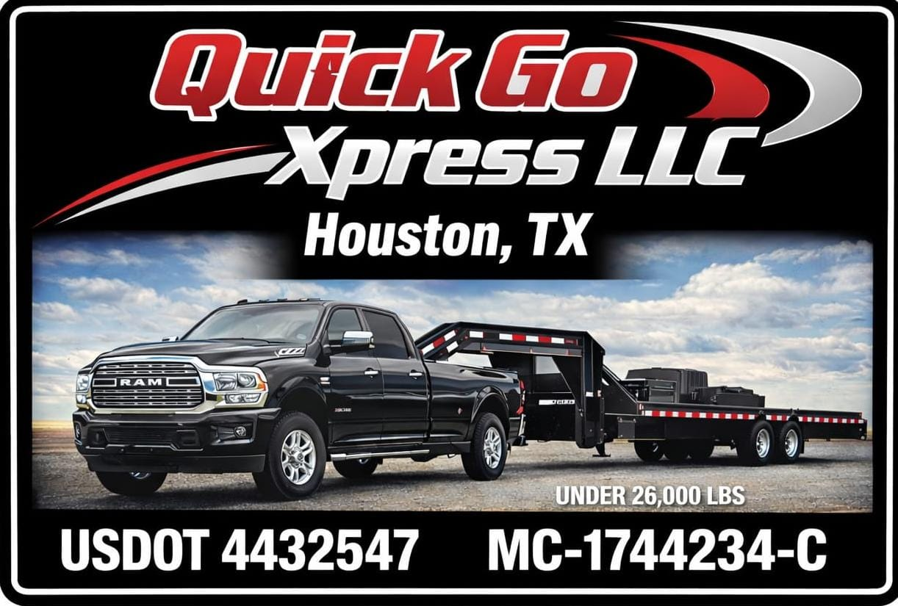
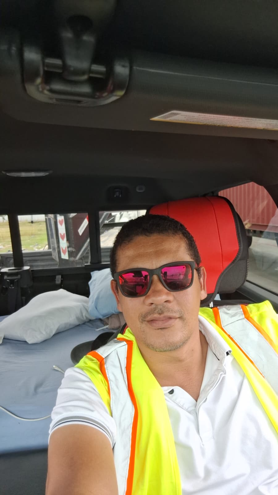

<html lang="en">
<head>
    <meta charset="UTF-8">
    <meta name="viewport" content="width=device-width, initial-scale=1.0">
    <title>QUICKGOXPRESS - Company</title>
    <!-- Font Awesome for Icons -->
    <link rel="stylesheet" href="https://cdnjs.cloudflare.com/ajax/libs/font-awesome/6.4.0/css/all.min.css">
    <!-- External CSS Link -->
    <link rel="stylesheet" href="QGP.css">
</head>
<body>

    <header>
        

            
        

        

            <nav>
                <a href="#home">Home</a>
                <a href="#info">Information</a>
                <a href="#team">Personal</a>
                <a href="#contact">Contact Us</a>
            </nav>

            

                <input type="text" id="vehicleSearch" class="search-box" placeholder="Search brand (e.g. Volvo)...">
                <i class="fa-solid fa-magnifying-glass"></i>
            

        

    </header>

    

        <h1 class="company-name">QUICKGOXPRESS</h1>
        
Logistics & Heavy Duty Cargo Portfolio

    

    <!-- INFORMATION SECTION -->
    <section class="content-block" id="info">
        <h2>Operations Information</h2>
        
At <strong>QUICKGOXPRESS</strong>, we lead the mobilization of trucks and commercial transport fleets. Based in <strong>Texas, United States</strong>, we run a 100% certified and fully legal operation. We proudly provide support in both English and Spanish to ensure seamless communication with all our clients.

        
        <!-- Legal & Location Credentials Bar -->
        

            

                <i class="fa-solid fa-scale-balanced"></i>
                <strong>MC #</strong> 1744234-C
            

            

                <i class="fa-solid fa-id-card"></i>
                <strong>DOT #</strong> 4432547
            

            

                <i class="fa-solid fa-location-dot"></i>
                4910 Talina Way, Houston, TX 77041
            

        

        

            

                <h3>Heavy Transport</h3>
                
Units optimized for large-scale cargo with reinforced structural support.

            

            

                <h3>Active Monitoring</h3>
                
Continuous tracking of freight and fleet status throughout the entire route.

            

            

                <h3>Logistics Efficiency</h3>
                
Advanced route planning strategies to significantly reduce transit times and operational costs.

            

        

    </section>

    <!-- TEAM SECTION -->
    <section class="content-block" id="team">
        <h2>Our Personnel</h2>
        
Meet the professional team responsible for managing and coordinating the logistical operations of our fleet.

        
        

            <!-- First Person: Juan Rodriguez -->
            

                

                    
                

                <h3>Juan Rodriguez</h3>
                +1(718)749-8881
                
Spanish

            

            <!-- Second Person: Mayra Rincon -->
            

                

                    
                

                <h3>Mayra Rincon</h3>
                +1(832)566-3654
                
Bilingual.

            

        

    </section>

    <!-- CONTACT FORM -->
    <section class="content-block" id="contact">
        <h2>Contact Us</h2>
        
If you need to coordinate a heavy cargo service or want to learn more about our fleet availability, leave us a message below.

        
        <form class="contact-form" action="https://formsubmit.co/quickgox@gmail.com" method="POST">
            <input type="hidden" name="_next" value="https://quickgoxpress.com">
            <input type="hidden" name="_subject" value="New Message from QUICKGOXPRESS Website">
            <input type="hidden" name="_captcha" value="false">

            <input type="text" name="Name" placeholder="Your Name" required>
            <input type="email" name="Email" placeholder="Your Email Address" required>
            <textarea name="Message" rows="4" placeholder="Detail the type of truck or logistics service you require..." required></textarea>
            
            <button type="submit">Send Message</button>
        </form>
    </section>

    <footer>
        &copy; 2026 QUICKGOXPRESS - Professional Trucking & Logistics Portfolio.
    </footer>

    <!-- External JavaScript Link -->
    
</body>
</html>
